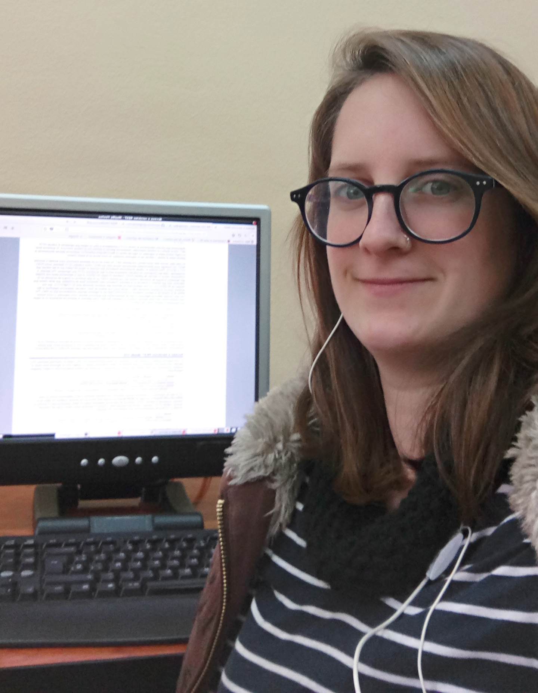

# PROPERLY-CINTIA GARCIA RUIZ

## Sobre Properly Software:

Es una empresa con un largo recorrido en el desarrollo de aplicaciones informáticas, siendo especialistas en un sector específico como es  el sector de la construcción e instalación de fontanería, gas, electricidad, aislamientos, calefacción...
Su exito se debe a que supieron ver las necesidades de esos clientes, para crear un software que les fuera útil en su trabajo. Son una empresa cercana y pequeñita pero que tiene un gran potencial,ya que llevan muchos años trabajando duro.

## Mi experiencia personal-Cintia:

Para mi esta experiencia en la empresa ha sido bastante buena. He tenido buen trato con los compañeros y la verdad que hemos tenido mucha libertad a la hora de trabajar. El estar más personas haciendo las prácticas conjuntamente ha sido una experiencia positiva, porque cuando he tenido alguna duda pues he podido resolverla con ayuda de ellos. Al principio era un poco abrumador puesto que eran conceptos nuevos y me costaba comprenderlos, pero después poco a poco fui cogiendo el hilo y me pareció super interesante lo que estaba aprendiendo.

## Mi experiencia personal-Denise:
Mi experiencia en Properly ha sido muy positiva.  Llegué allí convencida de que recibiría clases pero estaba equivocada. 
Desde el primer día tuve que enfrentarme tareas que hacer sin saber cómo realizarlas
Tuve que documentarme, tuve que aprender a utilizar nuevo software por mi cuenta.
Gracias a otros alumnos en prácticas, mi experiencia fue mucho mejor y si tenía dudas podía contar con ellos para que me ayudaran.

